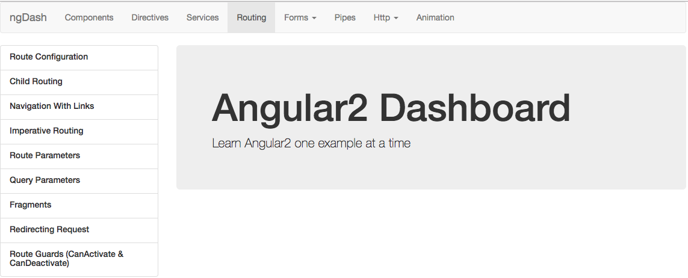

# angular2-dash
Angular2 Dashboard - Learning By Example

## Structure

- Components
 - NgModule
 - Creating a Component
 - Templates and Styles
 - View Encapsulation
 - NgContent
 - String Interpolation
 - Property Binding
 - Event Binding
 - Two-way Binding
 - Custom Events
 - Template Access
 - Component Lifecycle 
- Directives
 - Attribute Directives
 - Structural Directives
 - Custom Attribute Directive
 - Custom Structural Directive
 - Element Interaction (HostListener & HostBinding)
 - Directive Property Binding
- Services
 - Dependency Injection
 - Single Instance vs Multiple Instances
 - Using a Service in a Service
 - Cross-Component Services
- Routing
 - Route Configuration
 - Child Routing
 - Navigation With Links
 - Imperative Routing
 - Route Parameters
 - Query Parameters
 - Fragments
 - Redirecting Request
 - Route Guards (CanActivate & CanDeactivate)
- Forms
 - Template-Driven Approach 
    - Form Properties
    - Input Validation
    - Submitting Forms
    - Setting a Default Value
    - Form Groups
    - Property Validation
    - Form Reset
 - Data-Driven Approach
    - Input Validation
    - Submitting Forms
    - Form Groups
    - Form Arrays
    - Custom Validators
    - Custom Async Validators
    - Form Reset
- Pipes
 - Basic (built-in) Pipes
 - Pipe Arguments
 - Chaining Pipes
 - Custom Pipes
 - Pure Pipes vs Impure Pipes
 - Async Pipes
- Http
 - FireBase Setup
    - Data Structure
    - Basic Setup
 - CRUD Examples
    - GET Request
    - POST Request
    - PATCH Request
    - DELETE Request
    - Error Handling
- Animation
 - Triggers and States
 - State Transitions
 - State Transitions - Advanced
 - Transition Phases
 - Void (Any) State
 - Animation Keyframes
 - Grouping Animations
 - Animation Callbacks

## Installation

Install dependencies by running:

`npm install`

Run the app:

`ng serve`

Visit http://localhost:4200/

## Contribution

`Accepting pull requests`

Each menu item has its own module under the `./modules/your-module` directory. That module holds the components (lectures) of that item.

To create a new menu item  do the following:

1. Navigate to `./src/app/modules`
2. `ng g module your-module.module` - this will create a new directory called `your-module` with `your-module.module.ts` in it
 - this step is important as any component generated through the cli in the `your-module` directory will automatically be imported and declared in the module .ts file

To create a new lecture:

1. Navigate to your module directory (menu item)
2. `ng g component my-component.component` - this will create a component in the directory and auto-import it in the module's `declarations` array

Make sure to create an `index.ts` file in order to export everything associated with the module, including the module itself.
Then, under the `index.ts` of the `./src/app/modules`, append `export * from './your-module'`

This will allow all lectures and their components to be imported from `./src/app/modules`.

Then, in `./src/app/menu/nav.module.ts`, import the new module from `../modules` and add it to the `imports` array metadata

Last step is to add the new menu item and any lectures in the `nav-items.ts` by following the structure in that file. This shows the new menu item on the dashboard. 

**Note**: In order to have sub-menu items, take a look at './src/app/modules/forms' structure and do the same.

##Contributors

- [Mohamad Atieh](https://github.com/MohamadAtieh)

## License

MIT
